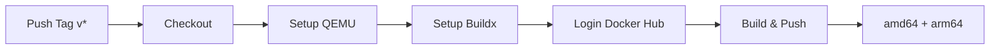

[根目录](../CLAUDE.md) > **Action**

---

# Action - GitHub Actions 工作流模板

> **模块职责**: 提供可复用的 GitHub Actions CI/CD 工作流配置模板

---

## 变更记录 (Changelog)

### 2025-12-13
- 初始化模块文档
- 完成所有工作流配置说明
- 添加 Secrets 配置指南

---

## 模块职责

本模块包含 GitHub Actions 工作流模板,用于:
- Docker 镜像自动构建与推送
- 仓库自动同步(GitHub → GitHub/Gitee)
- 工作流日志自动清理
- Fork 仓库自动更新

---

## 工作流清单

| 文件名 | 功能 | 触发条件 | 推送目标 |
|-------|------|---------|---------|
| `docker.yml` | Docker 多架构构建 | tag:v*, PR 合并 | Docker Hub |
| `deploy-docker.yml` | Docker 镜像 CI/CD | tag:v* | Docker Hub |
| `Auto clean workflows.yml` | 工作流日志清理 | 每周日 00:00, 手动 | - |
| `repo_sync.yml` | 仓库同步 | 每日 19:00, 手动 | GitHub/Gitee |
| `sync.yml` | Fork 自动同步 | 每周一 22:00, 手动 | 目标仓库 |

---

## 工作流详解

### docker.yml - Docker 多架构构建

**功能概述**:
- 使用 Docker Buildx 构建多架构镜像
- 支持 linux/amd64 和 linux/arm64
- 自动推送到 Docker Hub

**触发条件**:
```yaml
on:
  workflow_dispatch:       # 手动触发
  push:
    tags:
      - v*                 # tag 以 v 开头时触发
  pull_request:
    types: [closed]
    branches:
      - main               # PR 合并到 main 时触发
```

**所需 Secrets**:
| Secret 名称 | 说明 | 获取方式 |
|------------|------|---------|
| `DOCKER_HUB_USERNAME` | Docker Hub 用户名 | Docker Hub 账户 |
| `DOCKER_HUB_ACCESS_TOKEN` | Docker Hub 访问令牌 | Docker Hub → Account Settings → Security → New Access Token |

**配置步骤**:

1. **创建 Docker Hub Access Token**:
   - 登录 [Docker Hub](https://hub.docker.com)
   - 进入 Account Settings → Security
   - 点击 "New Access Token"
   - 复制生成的 Token

2. **配置 GitHub Secrets**:
   - 进入仓库 Settings → Secrets and variables → Actions
   - 点击 "New repository secret"
   - 添加 `DOCKER_HUB_USERNAME` 和 `DOCKER_HUB_ACCESS_TOKEN`

3. **修改镜像标签**:
   ```yaml
   # 修改第 42 行
   tags: your-username/your-image:latest
   ```

4. **修改 Dockerfile 路径**(如需要):
   ```yaml
   file: Dockerfile  # 或 docker/Dockerfile
   ```

**工作流程**:


---

### deploy-docker.yml - Docker 镜像 CI/CD

**功能概述**:
- 基础版 Docker 构建推送流程
- 支持版本号从 tag 自动提取
- 支持自定义镜像命名空间

**触发条件**:
```yaml
on:
  workflow_dispatch:       # 手动触发
  push:
    tags:
      - v*                 # tag 以 v 开头时触发
```

**所需 Secrets**:
| Secret 名称 | 说明 |
|------------|------|
| `DOCKER_USERNAME` | Docker Hub 用户名 |
| `DOCKER_PASSWORD` | Docker Hub 密码 |

**配置步骤**:

1. **修改环境变量**:
   ```yaml
   env:
     IMAGE_NAME: your-image-name  # 镜像名称
   ```

2. **修改 Dockerfile 路径**:
   ```yaml
   run: docker build . --file docker/Dockerfile --tag $IMAGE_NAME
   ```

3. **修改镜像命名空间**:
   ```yaml
   IMAGE_ID=your-namespace/$IMAGE_NAME
   ```

**版本号处理逻辑**:
- Tag `v1.2.3` → 镜像版本 `1.2.3`
- Branch `master` → 镜像版本 `latest`

---

### Auto clean workflows.yml - 工作流日志清理

**功能概述**:
- 自动清理旧的 GitHub Actions 运行记录
- 保留最近 5 天的记录
- 不保留最少运行次数

**触发条件**:
```yaml
on:
  schedule:
    - cron: '0 0 * * 0'    # 每周日 00:00 UTC
  workflow_dispatch:        # 手动触发
```

**配置参数**:
```yaml
with:
  retain_days: '5'          # 保留天数
  keep_minimum_runs: '0'    # 最少保留运行次数
```

**依赖 Action**: `GitRML/delete-workflow-runs@main`

**使用场景**:
- 清理 CI/CD 日志,节省 Actions 存储空间
- 保持仓库整洁

---

### repo_sync.yml - 仓库同步

**功能概述**:
- 从上游仓库同步代码到当前仓库
- 可选同步到 Gitee(国内镜像)
- 支持多种同步策略

**触发条件**:
```yaml
on:
  schedule:
    - cron: '0 19 * * *'   # 每日 19:00 UTC (北京时间 03:00)
  workflow_dispatch:        # 手动触发
  watch:
    types: started          # Star 仓库时触发
  repository_dispatch:
    types: sync-sazs34-scripts
```

**所需 Secrets**:
| Secret 名称 | 说明 | 用途 |
|------------|------|------|
| `PAT` | GitHub Personal Access Token | GitHub 仓库同步 |
| `GITEE_PRIVATE_KEY` | Gitee SSH 私钥 | Gitee 仓库推送 |
| `GITEE_TOKEN` | Gitee API Token | 自动创建 Gitee 仓库 |

**配置步骤**:

1. **创建 GitHub PAT**:
   - 进入 GitHub Settings → Developer settings → Personal access tokens
   - 创建 Token,勾选 `repo` 权限
   - 复制 Token 保存

2. **配置上游仓库**:
   ```yaml
   with:
     source_repo: "https://github.com/owner/repo.git"  # 上游仓库
     source_branch: "master"                            # 源分支
     destination_branch: "main"                         # 目标分支
   ```

3. **(可选) 配置 Gitee 同步**:
   - 生成 SSH 密钥对: `ssh-keygen -t ed25519`
   - 将公钥添加到 Gitee: https://gitee.com/profile/sshkeys
   - 将私钥添加到 GitHub Secrets: `GITEE_PRIVATE_KEY`
   - 创建 Gitee API Token: https://gitee.com/profile/personal_access_tokens

**依赖 Actions**:
- `repo-sync/github-sync@v2`: GitHub 仓库同步
- `Yikun/hub-mirror-action@master`: GitHub ↔ Gitee 镜像

---

### sync.yml - Fork 自动同步

**功能概述**:
- 自动将上游仓库的更新同步到 Fork 仓库
- 支持强制推送
- 支持 Tag 同步

**触发条件**:
```yaml
on:
  schedule:
    - cron: '0 22 * * 1'   # 每周一 22:00 UTC
  workflow_dispatch:        # 手动触发
```

**所需 Secrets**:
| Secret 名称 | 说明 |
|------------|------|
| `GH_PERSONAL_ACCESS_TOKEN` | GitHub Personal Access Token |

**配置参数**:
```yaml
with:
  github_token: ${{ secrets.GH_PERSONAL_ACCESS_TOKEN }}
  upstream_repository: owner/repo           # 上游仓库
  target_repository: your-username/repo     # 目标仓库(你的 Fork)
  upstream_branch: master                   # 上游分支
  target_branch: master                     # 目标分支
  force: true                               # 强制推送
  tags: true                                # 同步 Tags
```

**依赖 Action**: `TobKed/github-forks-sync-action@master`

**使用场景**:
- 保持 Fork 仓库与上游同步
- 自动化依赖项目的更新

---

## Secrets 配置汇总

### GitHub Secrets 配置位置
仓库 → Settings → Secrets and variables → Actions → New repository secret

### 所有 Secrets 清单

| Secret 名称 | 用途 | 获取方式 |
|------------|------|---------|
| `DOCKER_HUB_USERNAME` | Docker Hub 用户名 | Docker Hub 账户 |
| `DOCKER_HUB_ACCESS_TOKEN` | Docker Hub 令牌 | Docker Hub → Security |
| `DOCKER_USERNAME` | Docker Hub 用户名(旧版) | 同上 |
| `DOCKER_PASSWORD` | Docker Hub 密码(旧版) | Docker Hub 账户 |
| `PAT` | GitHub Personal Access Token | GitHub → Developer settings |
| `GH_PERSONAL_ACCESS_TOKEN` | GitHub PAT(别名) | 同上 |
| `GITEE_PRIVATE_KEY` | Gitee SSH 私钥 | `ssh-keygen` 生成 |
| `GITEE_TOKEN` | Gitee API Token | Gitee → Personal Access Tokens |

---

## 使用指南

### 如何使用这些模板

1. **复制工作流文件**:
   ```bash
   # 复制到你的仓库
   cp Action/docker.yml your-repo/.github/workflows/docker.yml
   ```

2. **修改配置**:
   - 替换镜像名称、仓库地址
   - 配置所需的 Secrets

3. **触发工作流**:
   - 推送带有 `v` 前缀的 Tag: `git tag v1.0.0 && git push --tags`
   - 或在 Actions 页面手动触发

### Cron 表达式说明

```
┌───────────── 分钟 (0-59)
│ ┌───────────── 小时 (0-23)
│ │ ┌───────────── 日 (1-31)
│ │ │ ┌───────────── 月 (1-12)
│ │ │ │ ┌───────────── 星期 (0-6, 0=周日)
│ │ │ │ │
* * * * *

示例:
'0 0 * * 0'    → 每周日 00:00 UTC
'0 19 * * *'   → 每天 19:00 UTC
'0 22 * * 1'   → 每周一 22:00 UTC
```

**时区说明**: GitHub Actions 使用 UTC 时区,北京时间 = UTC + 8

---

## 常见问题 (FAQ)

**Q: Docker 构建失败,提示 "unauthorized"?**
A: 检查 Secrets 配置:
1. 确认 `DOCKER_HUB_USERNAME` 和 `DOCKER_HUB_ACCESS_TOKEN` 已正确设置
2. Access Token 需要有 `Read, Write, Delete` 权限

**Q: 仓库同步失败,提示 "Permission denied"?**
A: 确认 PAT 有足够权限:
1. 需要勾选 `repo` (Full control of private repositories)
2. 对于 Fork 同步,还需要 `workflow` 权限

**Q: 工作流没有按时触发?**
A:
1. GitHub Actions 的 cron 触发不保证准时,可能延迟几分钟到几十分钟
2. 确保仓库在最近 60 天内有活动,否则定时任务会被禁用

**Q: 如何手动触发工作流?**
A: 仓库 → Actions → 选择工作流 → Run workflow

**Q: Gitee 同步失败?**
A:
1. 确认 SSH 密钥配置正确
2. 检查 Gitee Token 是否过期
3. 确认目标仓库名称正确

---

## 相关文件清单

```
Action/
├── docker.yml                   # Docker 多架构构建(推荐)
├── deploy-docker.yml            # Docker CI/CD(基础版)
├── Auto clean workflows.yml     # 工作流日志清理
├── repo_sync.yml                # 仓库同步(GitHub/Gitee)
├── sync.yml                     # Fork 自动同步
└── CLAUDE.md                    # 本文档
```

**推荐使用**:
- `docker.yml`: 现代化的多架构 Docker 构建流程
- `Auto clean workflows.yml`: 保持仓库整洁

---

## 相关模块

- [Sh/docker](./Sh/docker/CLAUDE.md): Docker 安装与证书管理
- [Work](./Work/CLAUDE.md): Cloudflare Workers 脚本

---

**维护者**: Silentely
**最后更新**: 2025-12-13
