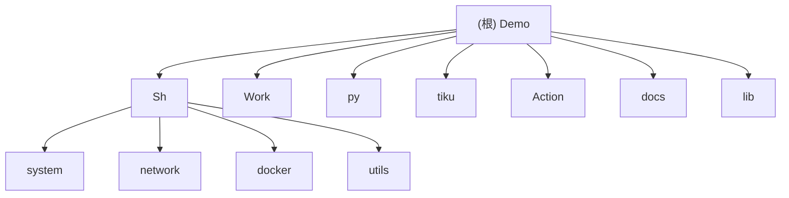

# Demo 项目 - AI 上下文索引

> **最后更新**: 2025-12-15
> **维护状态**: 佛系维护 | 自用工具集

---

## 📋 变更记录 (Changelog)

### 2025-12-15
- **tiku 模块 v1.1.0 重大更新**
  - 新增 argparse CLI 参数解析（`--version`, `-v/--verbose`, `--dry-run`）
  - 新增数据质量验证功能
  - 优化文件编码检测性能
  - 增强错误处理与转换报告

### 2025-12-13
- 初始化 AI 上下文文档
- 完成项目结构扫描与模块识别
- 生成模块级文档索引
- **补充 Sh/docker 模块文档** - 证书生成流程与续期机制
- **补充 Sh/utils 模块文档** - backup_postgres.sh 配置说明
- **补充 Action 模块文档** - GitHub Actions 工作流说明

---

## 🎯 项目愿景

Demo 是一个个人维护的日常工具脚本仓库,主要服务于 Linux 系统运维、网络配置、Docker 管理、Cloudflare Workers 开发等场景。项目秉持"佛系维护,自用为主"的理念,提供经过实践验证的实用工具。

**设计哲学**:
- 实用优先,解决真实痛点
- 一键执行,降低使用门槛
- 社区友好,支持远程直接运行
- 模块化组织,便于维护与扩展

---

## 🏗️ 架构总览

### 技术栈
- **Shell**: Bash 脚本,适配主流 Linux 发行版(CentOS/Debian/Ubuntu/Alpine)
- **Python**: 3.x,用于复杂逻辑处理和数据转换
- **JavaScript**: Cloudflare Workers 运行时
- **文档工具**: openpyxl、python-docx、olefile

### 核心特性
1. **系统优化**: 系统清理、语言配置、终端美化、swap 管理
2. **网络工具**: 代理部署(HTTP/SOCKS5/Gost)、防火墙配置、NAT64 优选
3. **容器管理**: Docker 安装与 TLS 证书自动配置
4. **边缘计算**: Docker Hub 镜像代理、Telegram Bot API 代理
5. **数据处理**: 多格式题库转换(Excel/Word/Doc → 标准格式)

---

## 🗂️ 模块结构图



---

## 📚 模块索引

| 模块路径 | 职责 | 语言 | 入口文件 | 配置 |
|---------|------|------|---------|------|
| [Sh/system](./Sh/system/CLAUDE.md) | 系统相关工具脚本 | Shell | cleanup.sh, terminal_optimizer.sh, nat64_optimizer.sh 等 | - |
| [Sh/network](./Sh/network/CLAUDE.md) | 网络配置与代理工具 | Shell | gost.sh, http_install.sh, socks5_install.sh 等 | - |
| [Sh/docker](./Sh/docker/CLAUDE.md) | Docker 安装与证书管理 | Shell | DockerInstallation.sh, docker-ca.sh | ✅ 完整文档 |
| [Sh/utils](./Sh/utils/CLAUDE.md) | 通用工具脚本 | Shell | ssh_key.sh, ChangeMirrors.sh, backup_postgres.sh 等 | ✅ 完整文档 |
| [Work](./Work/CLAUDE.md) | Cloudflare Workers 脚本 | JavaScript | mirror.js, proxy.js, tgapi.js 等 | - |
| [py](./py/CLAUDE.md) | Python 工具脚本 | Python | cc.py | - |
| [tiku](./tiku/CLAUDE.md) | 题库格式转换工具 | Python | convert_all_questions_motibang.py, convert_all_questions_shuatidadang.py | ✅ v1.1.0 |
| [lib](./lib/CLAUDE.md) | 公共库文件 | Shell | common.sh | - |
| [docs](./docs/CLAUDE.md) | 项目文档 | Markdown | structure.md, examples.md, contributing.md | - |
| [Action](./Action/CLAUDE.md) | GitHub Actions 工作流模板 | YAML | docker.yml, sync.yml, repo_sync.yml 等 | ✅ 完整文档 |

---

## 🚀 运行与开发

### 快速开始

**远程直接运行**（推荐）:
```bash
# 示例: 系统清理
bash <(curl -sSL https://raw.githubusercontent.com/Silentely/Demo/refs/heads/main/Sh/system/cleanup.sh)

# 示例: Docker 安装
bash <(curl -sSL https://raw.githubusercontent.com/Silentely/Demo/refs/heads/main/Sh/docker/DockerInstallation.sh)
```

**本地克隆运行**:
```bash
git clone https://github.com/Silentely/Demo.git
cd Demo
chmod +x Sh/**/*.sh
./Sh/system/cleanup.sh
```

### 开发环境

**依赖要求**:
- Bash 4.0+
- Python 3.6+ (可选,用于 Python 工具)
- curl, awk, grep 等基础工具

**推荐工具**:
- ShellCheck: Shell 脚本静态分析
- `lib/common.sh`: 统一的颜色定义与日志函数

---

## 🧪 测试策略

### 脚本测试
- **手动测试**: 在多个 Linux 发行版(Debian/Ubuntu/CentOS)上验证
- **安全性**: 所有脚本包含错误处理机制,支持 `-h/--help` 参数
- **回滚**: 关键操作(如配置修改)自动备份原文件

### Python 工具测试
- 运行单元测试(如有):
  ```bash
  python3 -m pytest tests/
  ```

---

## 📝 编码规范

### Shell 脚本规范
1. **头部注释**: 包含脚本用途、版本、作者信息
2. **错误处理**: 使用 `set -e` 或显式错误检查
3. **颜色输出**: 引用 `lib/common.sh` 中的统一颜色定义
4. **参数支持**: 提供 `-h/--help` 帮助信息
5. **依赖检查**: 脚本开始时检查必需命令是否存在

### Python 规范
1. **编码声明**: 文件头包含 `# -*- coding: utf-8 -*-`
2. **文档字符串**: 模块、函数使用 docstring 说明
3. **类型注解**: 关键函数提供类型提示
4. **错误处理**: 使用 try-except 捕获异常并输出友好错误信息

### 提交信息规范
- 格式: `feat/fix/docs/refactor: 简洁描述`
- 示例: `feat(system): 添加 NAT64 优选脚本`

---

## 🤖 AI 使用指引

### 高频任务
1. **添加新脚本**: 参考 `Sh/system/cleanup.sh` 的结构,复用 `lib/common.sh` 函数
2. **调试网络问题**: 查看 `Sh/network/nat64_optimizer.sh` 的日志输出与错误处理
3. **修改 Worker 脚本**: 理解 `Work/mirror.js` 的代理逻辑与 CORS 处理

### 关键路径
- **公共库**: `lib/common.sh` - 所有脚本共享的函数库
- **文档**: `docs/structure.md` - 目录结构说明
- **示例**: `docs/examples.md` - 各脚本使用示例

### 注意事项
- 所有脚本使用简体中文注释
- NAT64 优选脚本 (`nat64_optimizer.sh`) 包含复杂的测速与 DNS 配置逻辑,修改需谨慎
- Python DDoS 测试脚本 (`cc.py`) 仅用于授权安全测试,禁止攻击 .gov 网站

---

## 🔍 相关资源

- **GitHub 仓库**: https://github.com/Silentely/Demo
- **许可证**: MIT License (代码) + CC BY-NC-SA 4.0 (文档)
- **贡献指南**: [docs/contributing.md](./docs/contributing.md)
- **使用示例**: [docs/examples.md](./docs/examples.md)

---

## 📊 项目统计

- **总脚本数**: 26+ Shell 脚本
- **语言分布**: Shell 60%, Python 25%, JavaScript 10%, 其他 5%
- **最活跃模块**: Sh/system (5 星使用频率)
- **测试覆盖**: 手动测试 (多发行版验证)
