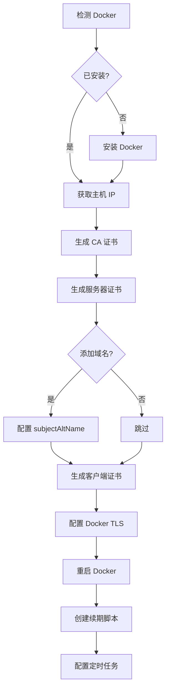

[根目录](../../CLAUDE.md) > [Sh](../) > **docker**

---

# Sh/docker - Docker 安装与证书管理

> **模块职责**: 提供 Docker 一键安装和 TLS 证书自动配置工具

---

## 变更记录 (Changelog)

### 2025-12-13
- 初始化模块文档
- 完成证书生成流程与续期机制说明
- 添加详细的接口文档

---

## 模块职责

本模块包含 Docker 相关的部署与安全配置工具:
- Docker CE 多源一键安装(支持国内镜像加速)
- Docker TLS 证书自动生成与配置
- 证书自动续期定时任务
- Docker Compose 安装

---

## 入口与启动

### 主要脚本入口

| 脚本名 | 功能 | 复杂度 | 执行方式 |
|-------|------|--------|---------|
| `DockerInstallation.sh` | Docker CE 多源一键安装 | 高 (708行) | `bash DockerInstallation.sh` |
| `docker-ca.sh` | Docker TLS 证书自动配置 | 中 (128行) | `bash docker-ca.sh` |
| `docker-cas.sh` | 简化版证书生成 | 低 (20行) | `bash docker-cas.sh <IP地址>` |

### 远程执行示例
```bash
# Docker 一键安装
bash <(curl -sSL https://raw.githubusercontent.com/Silentely/Demo/refs/heads/main/Sh/docker/DockerInstallation.sh)

# Docker TLS 证书配置
bash <(curl -sSL https://raw.githubusercontent.com/Silentely/Demo/refs/heads/main/Sh/docker/docker-ca.sh)
```

---

## 对外接口

### DockerInstallation.sh

**功能概述**:
- 支持 Debian/Ubuntu/CentOS/Fedora/RHEL/Kali 等多种发行版
- 提供多种 Docker CE 源选择(阿里云、腾讯云、华为云、Azure、网易、清华、中科大、官方)
- 提供多种 Docker Hub 镜像源选择(共 12 个)
- 可选安装 Docker Compose

**交互式选项**:
1. 选择 Docker CE 安装源 (1-8)
2. 是否安装最新版本 (Y/n)
3. 选择 Docker Hub 镜像源 (1-12)
4. 是否安装 Docker Compose (Y/n)
5. 是否使用国内代理下载 Compose (Y/n)

**Docker CE 源列表**:
| 序号 | 源名称 | 域名 |
|-----|-------|------|
| 1 | 阿里云 | mirrors.aliyun.com/docker-ce |
| 2 | 腾讯云 | mirrors.cloud.tencent.com/docker-ce |
| 3 | 华为云 | repo.huaweicloud.com/docker-ce |
| 4 | Azure | mirror.azure.cn/docker-ce |
| 5 | 网易 | mirrors.163.com/docker-ce |
| 6 | 清华大学 | mirrors.tuna.tsinghua.edu.cn/docker-ce |
| 7 | 中科大 | mirrors.ustc.edu.cn/docker-ce |
| 8 | 官方 | download.docker.com |

**Docker Hub 镜像源列表**:
| 序号 | 源名称 | 地址 |
|-----|-------|------|
| 1-5 | 阿里云 | registry.cn-{beijing,hangzhou,chengdu,guangzhou,hongkong}.aliyuncs.com |
| 6 | 腾讯云 | mirror.ccs.tencentyun.com |
| 7 | 华为云 | *.mirror.swr.myhuaweicloud.com |
| 8 | Azure | dockerhub.azk8s.com |
| 9 | DaoCloud | f1361db2.m.daocloud.io |
| 10 | 中科大 | docker.mirrors.ustc.edu.cn |
| 11 | 谷歌云 | gcr.io |
| 12 | 官方 | registry.docker-cn.com |

**输出文件**:
- `/etc/docker/daemon.json`: Docker 守护进程配置(镜像源)
- `/etc/docker/daemon.json.bak`: 配置备份文件

---

### docker-ca.sh

**功能概述**:
- 自动检测并安装 Docker(如未安装)
- 生成 CA 证书(4096位 RSA,AES256加密)
- 生成服务器证书和客户端证书
- 配置 Docker 使用 TLS(端口 2376)
- 创建证书自动续期定时任务

**执行流程**:


**交互式选项**:
- 是否添加受信任域名 (y/n)
- 如果选择 y,输入域名

**证书有效期**: 365 天

**证书存储路径**: `/root/docker-ca/`
```
/root/docker-ca/
├── ca-key.pem          # CA 私钥(AES256 加密)
├── ca.pem              # CA 证书
├── server-key.pem      # 服务器私钥
├── server-cert.pem     # 服务器证书
├── server.csr          # 服务器证书签名请求
├── client-key.pem      # 客户端私钥
├── client-cert.pem     # 客户端证书
├── client.csr          # 客户端证书签名请求
├── extfile.cnf         # 扩展配置(subjectAltName)
├── client-extfile.cnf  # 客户端扩展配置
├── renewcert.sh        # 自动续期脚本
└── crontab_log.txt     # 续期日志
```

**Docker TLS 配置**:
- 监听端口: 2376 (TCP)
- 配置文件: `/lib/systemd/system/docker.service`
- 启动参数: `--tlsverify --tlscacert --tlscert --tlskey`

**证书续期机制**:
- 定时任务: 每 15 天检查一次 (`0 0 */15 * * *`)
- 检查逻辑: CA 证书剩余有效期 < 20 天时触发续期
- 续期操作: 重新生成 CA、服务器、客户端证书并重启 Docker
- 日志文件: `/root/docker-ca/crontab_log.txt`

**注意事项**:
- CA 密码为硬编码: `changepasswd`(生产环境建议修改)
- 需要 root 权限执行
- 配置前会自动备份原 Docker 服务配置

---

### docker-cas.sh

**功能概述**:
- 简化版证书生成脚本
- 不自动配置 Docker,仅生成证书文件
- 需要手动传入 IP 地址

**使用方法**:
```bash
bash docker-cas.sh <服务器IP>
# 示例:
bash docker-cas.sh 192.168.1.100
```

**交互式输入**:
- CA 私钥密码
- CA 证书信息(国家、省份、组织等)

**输出文件**(当前目录):
```
./
├── ca-key.pem          # CA 私钥
├── ca.pem              # CA 证书
├── server-key.pem      # 服务器私钥
├── server-cert.pem     # 服务器证书
├── server.csr          # 服务器证书签名请求
├── key.pem             # 客户端私钥
├── cert.pem            # 客户端证书
├── client.csr          # 客户端证书签名请求
├── extfile.cnf         # 服务器扩展配置
└── extfile-client.cnf  # 客户端扩展配置
```

**文件权限**:
- 私钥文件: 0400 (仅所有者可读)
- 证书文件: 0444 (所有人可读)

---

## 关键依赖与配置

### 系统依赖
- **必需**: curl, wget, openssl, systemctl
- **可选**: crontab(用于证书自动续期)

### 外部资源
- Docker 安装脚本: `https://get.docker.com`
- Docker Compose: `https://github.com/docker/compose/releases`
- DaoCloud 代理: `https://get.daocloud.io/`

### 配置文件
| 文件路径 | 用途 |
|---------|------|
| `/etc/docker/daemon.json` | Docker 守护进程配置 |
| `/lib/systemd/system/docker.service` | Docker 服务单元文件 |
| `/root/docker-ca/` | TLS 证书存储目录 |

---

## 数据模型

### Docker daemon.json 格式
```json
{
  "registry-mirrors": ["https://registry.cn-hangzhou.aliyuncs.com"]
}
```

### Docker TLS 启动参数
```bash
ExecStart=/usr/bin/dockerd -H fd:// --containerd=/run/containerd/containerd.sock \
  -H tcp://0.0.0.0:2376 \
  --tlsverify \
  --tlscacert=/root/docker-ca/ca.pem \
  --tlscert=/root/docker-ca/server-cert.pem \
  --tlskey=/root/docker-ca/server-key.pem
```

---

## 测试与质量

### 已测试环境
- Debian 11/12
- Ubuntu 20.04/22.04
- CentOS 7/8/Stream
- Fedora 37/38/39

### 错误处理
- Docker 安装失败时自动回滚配置
- TLS 配置失败时恢复原始 Docker 服务文件
- 网络检测失败时提示错误并退出

---

## 常见问题 (FAQ)

**Q: Docker TLS 配置后无法远程连接?**
A: 确保防火墙已开放 2376 端口,并使用正确的客户端证书:
```bash
docker --tlsverify \
  --tlscacert=/root/docker-ca/ca.pem \
  --tlscert=/root/docker-ca/client-cert.pem \
  --tlskey=/root/docker-ca/client-key.pem \
  -H tcp://<服务器IP>:2376 info
```

**Q: 证书续期失败?**
A: 检查 `/root/docker-ca/crontab_log.txt` 日志,确保:
1. CA 私钥密码正确(默认: `changepasswd`)
2. 原始 CSR 文件存在

**Q: 如何更换 CA 密码?**
A: 修改 `docker-ca.sh` 中所有 `changepasswd` 为新密码,然后重新执行脚本。

**Q: Docker Compose 安装失败?**
A: 非 x86_64 架构会使用 pip3 安装,确保已安装 Python3 和 pip3。

---

## 相关文件清单

```
Sh/docker/
├── DockerInstallation.sh    # Docker CE 多源一键安装 (708行)
├── docker-ca.sh             # Docker TLS 证书自动配置 (128行)
├── docker-cas.sh            # 简化版证书生成 (20行)
└── CLAUDE.md                # 本文档
```

**关键文件**:
- `DockerInstallation.sh`: 功能最全面,支持多发行版、多源、版本选择
- `docker-ca.sh`: 包含完整的证书生成、配置、续期流程

---

## 相关模块

- [Sh/system](../system/CLAUDE.md): 系统优化工具
- [Sh/utils](../utils/CLAUDE.md): 通用工具脚本
- [Work](../../Work/CLAUDE.md): Cloudflare Workers(含 Docker Hub 镜像代理)

---

**维护者**: Silentely
**最后更新**: 2025-12-13
